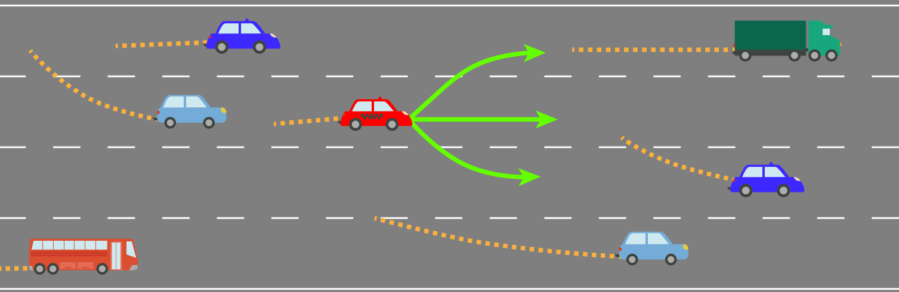
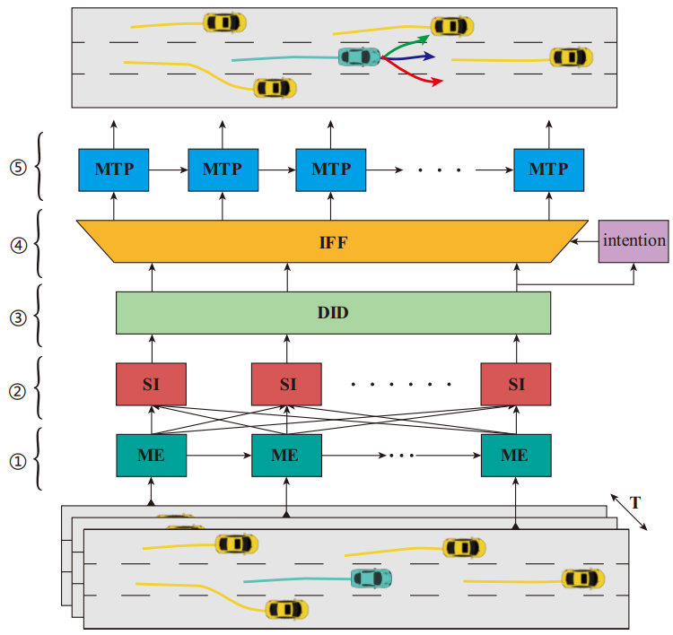
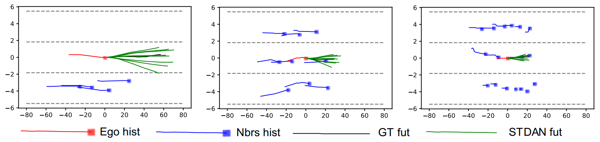
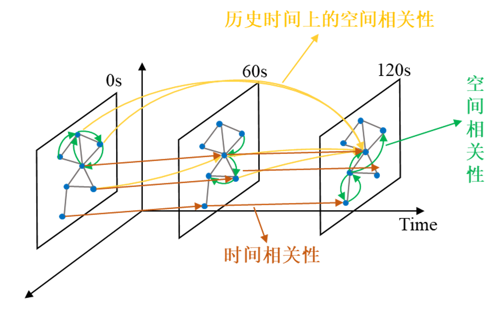
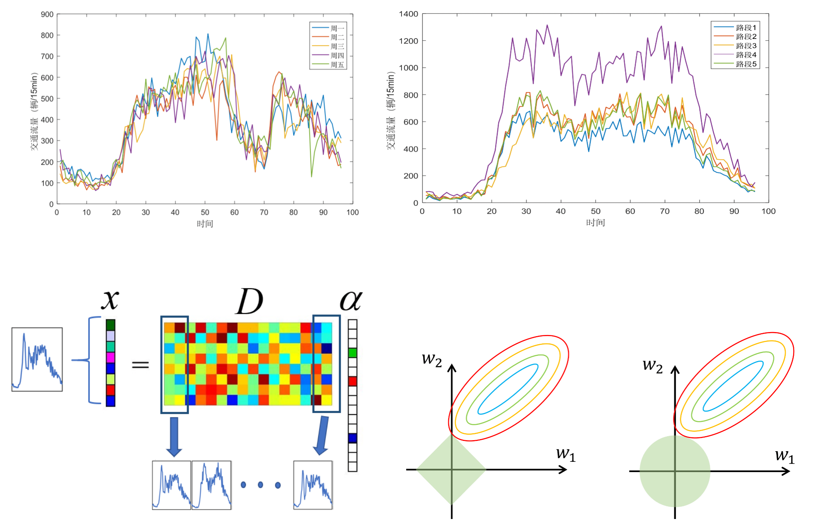
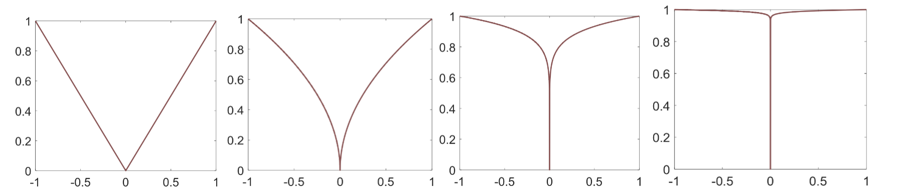
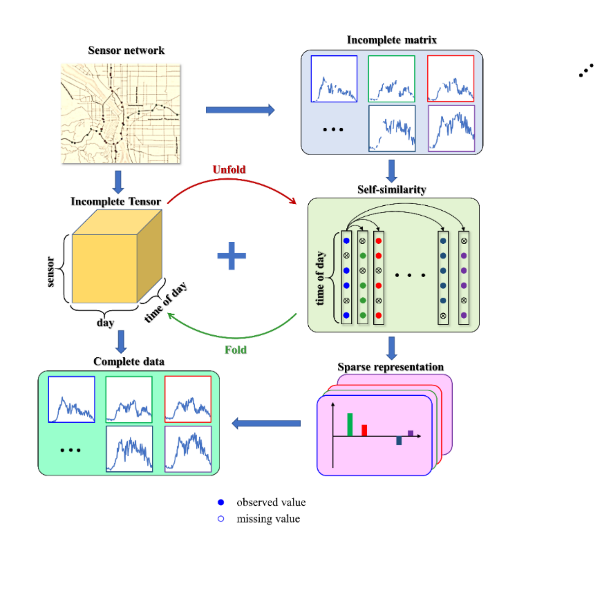

[车车/车路协同感知](#车车/车路协同感知)  ||  [轨迹预测](#轨迹预测)  ||  [车辆重识别](#车辆重识别)  ||  [交通数据缺失值恢复](#交通数据缺失值恢复)  ||  [交通流预测](#交通流预测)  ||  [脑信号分析](#脑信号分析)    ||  [统计机器学习](#统计机器学习)  ||  [交通场景语义分割](#交通场景语义分割)  ||  [车联网](#车联网)

### 轨迹预测

**相关成果**  
- <b>Xiaobo Chen</b>, Huanjia Zhang, et al., Intention-aware Vehicle Trajectory Prediction based on Spatial-temporal Dynamic Attention Network for Internet of Vehicles, <b><i>IEEE Transactions on Intelligent Transportation Systems</i></b>,3(10):19471-19483, 2022 (SCI)
- <b>Xiaobo Chen</b>, Huanjia Zhang, et al., Vehicle Trajectory Prediction Based on Intention-Aware Non-Autoregressive Transformer with Multi-Attention Learning for Internet of Vehicles, <b><i>IEEE Transactions on Instrumentation and Measurement</i></b>,71: 2513912, 2022 (SCI)
- Yu Hu,<b>Xiaobo Chen\*</b>, Intention-aware Transformer with Adaptive Social and Temporal Learning for Vehicle Trajectory Prediction, 26th <b><i>International Conference on Pattern Recognition</i></b>, 2022
- <b>Xiaobo Chen</b>, Huanjia Zhang, et al., Stochastic Non-Autoregressive Transformer-based Multimodal Pedestrian Trajectory Prediction for Intelligent Vehicles, <b><i>IEEE xxxx</i></b>, 2022
- <b>Xiaobo Chen</b>, Huanjia Zhang, et al., VNAT: Fast and Accurate Multi-Agent Trajectory Prediction Using Variational Non-Autoregressive Transformer for Intelligent Vehicles, <b><i>IEEE xxxx</i></b>, 2022
- <b>Xiaobo Chen</b>, Yuxiang Gao, et al., Driving Style Feature Extraction and Recognition Based on Hyperdimensional Computing and Semi-supervised Twin Projection Vector Machine, <b><i>IEEE xxxx</i></b>, 2022

### 交通数据缺失值恢复

**相关成果**  
- <b>Xiaobo Chen</b>, Shurong Liang, et al., A Novel Spatiotemporal Data Low-rank Imputation Approach for Traffic Sensor Network, <b><i>IEEE Internet of Things Journal</i></b>, 9(20): 20122-20135, 2022 (SCI) 
- <b>Xiaobo Chen</b>, Kaiyuan Wang, et al., Collaborative Nonconvex Low-rank Spatial-Temporal Data Tensor Completion for Smart Traffic IoT Network, <b><i>submitted to IEEE xxxx</i></b>, 2022
- <b>陈小波</b>，梁书荣，柯佳，陈玲，胡煜. 基于图正则化和Schatten-p范数的交通数据缺失值恢复方法, <b><i>西南交通大学学报</i></b>，2022(EI)
- <b>陈小波</b>,陈程,陈蕾,韦中杰,蔡英凤,周俊杰  基于改进低秩矩阵补全的交通量数据缺失值插补方法, <b><i>交通运输工程学报</i></b> 19(5):180-190, 2019(EI)  
- <b>Xiaobo Chen</b>, Yingfeng Cai, Qiaolin Ye, Lei Chen, Zuoyong Li. Graph Regularized Local Self-Representation for Missing Value Imputation with Applications to On-Road Traffic Sensor Data, <b><i>Neurocomputing</i></b> 303: 47-59, 2018 (SCI)   
- <b>Xiaobo Chen</b>, Yingfeng Cai, Qingchao Liu, Lei Chen, Nonconvex lp-norm Regularized Sparse Self-Representation for Traffic Sensor Data Recovery, <b><i>IEEE Access</i></b> 6: 24279-24290, 2018 (SCI)  
- <b>Xiaobo Chen</b>, Xinwen Cai, Jun Liang, Qingchao Liu. Ensemble Learning Multiple LSSVR with Improved Harmony Search Algorithm for Short-term Traffic Flow Forecasting, <b><i>IEEE Access</i></b> 6: 9347-9357, 2018 (SCI)  
- <b>Xiaobo Chen</b>, Cheng Chen, Yingfeng Cai, Hai Wang, Qiaolin Ye. Kernel Sparse Representation with Hybrid Regularization for On-Road Traffic Sensor Data Imputation, <b><i>Sensors</i></b> 18(9): 2884, 2018 (SCI)  
- <b>Xiaobo Chen</b>. An Improved Self-Representation Approach for Missing Value Imputation, 24th <b><i>International Conference on Pattern Recognition</i></b>, 2018 (EI)  
- <b>Xiaobo Chen</b>, Zhongjie Wei, Zuoyong Li, Jun Liang, Yingfeng Cai. Ensemble Correlation-based Low-rank Matrix Completion with Application to Traffic Data Imputation, <b><i>Knowledge-Based Systems</i></b>, 132 249-262, 2017 (SCI)  

### 车辆重识别

### 车车/车路协同感知

### 交通流预测

### 脑信号分析

### 统计机器学习

### 交通场景语义分割

### 车联网

